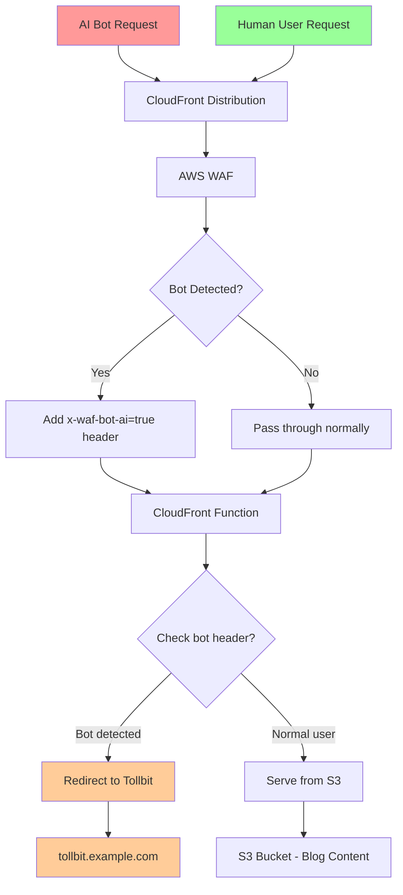

# AI Crawler Monetization Demo

> **Personal demo project** showcasing CloudFront + WAF integration with third-party monetization services for the AI era. Not affiliated with AWS.

Detect AI crawlers (GPTBot, ChatGPT-User, Claude-Web) using AWS WAF Bot Control and redirect them to monetization services like Tollbit via CloudFront Functions.

## What's Included
- WAF rules for AI bot detection
- CloudFront Function for monetization redirects  
- Sample blog content for testing

## Architecture Flow



## Quick Start

**Prerequisites**: AWS CLI, Node.js, CDK CLI (`npm install -g aws-cdk`)

```bash
npm install
npm run build
npx cdk deploy
```

**Tollbit Setup** (after deployment):
1. Create account at [app.tollbit.com](https://app.tollbit.com)
2. Add your domain property and [verify ownership](https://docs.tollbit.com/set-up-property#verifying-a-property)
3. Configure DNS routing:
   - `tollbit.example.com` → Tollbox
   - `example.com` → CloudFront distribution
4. Test with bot user agents

## Testing

```bash
# Test bot detection
curl -i -H "User-Agent: GPTBot/1.0" https://your-cloudfront-domain.cloudfront.net/
curl -i -H "User-Agent: ChatGPT-User/1.0" https://your-cloudfront-domain.cloudfront.net/

# Normal access
curl -i https://your-cloudfront-domain.cloudfront.net/
```

## Key Files
- `lib/` - CDK stack implementation
- `blog-content/` - Sample content for testing
- CloudWatch dashboard URL in deployment outputs

## Commands
- `npm run build` - Build project
- `npx cdk deploy` - Deploy to AWS
- `npx cdk destroy` - Clean up resources

## License

Personal demo project for educational purposes. Review AWS and third-party service terms before use.
